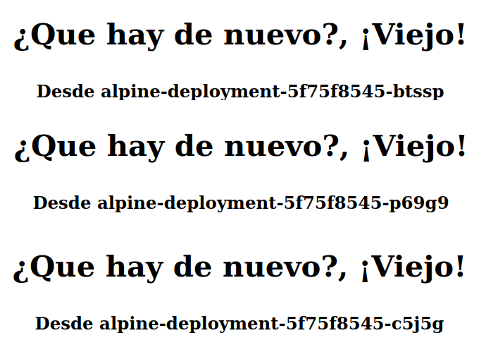
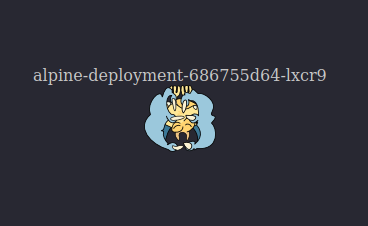

# MicroHackatones

## Caso1

### Descripción

Crear en Kubernetes un servicio que muestre una página web con el nombre del Pod que está corriendo  dicha página web.
El contenido del html de la página web  se tiene que cargar  en el pod desde un recurso externo. Una vez este funcionado, aumentar el número de replicas del servicio a 3 y comprobar si existe algún tipo de balanceo (indicar cual es en caso afirmativo).

### Tips

- Minikube
- Pod
- Deployments
- Services
- Labels
- Volumes
- Secrets/ConfigMaps
- Nginx/Apache
- Environment Variables
- PortForward

### Procedimiento

#### Imagen de contenedor

Para la resolución del caso usaremos la imagen de contenedor **alpine:3.19.0** ubicada en [dockerhub](https://hub.docker.com/layers/library/alpine/3.19.0/images/sha256-13b7e62e8df80264dbb747995705a986aa530415763a6c58f84a3ca8af9a5bcd?context=explore).

#### Netcat

Con **netcat**, `nc`, presente el la imagen de contenedor, podemos crear un pequeño servicio HTTP en el puerto que indiquemos. **NOTA.-** la versión que encontramos habitualmente en las distribuciones Linux es *openbsd-netcat*, mientras que Alpine usa *busybox*, de ahí la necesidad de especificar la opción `-p` para el puerto de servicio. Ejemplo.

``` BASH
while true; do { echo -e 'HTTP/1.1 200 OK\r\n'; echo '<html><br><H1><p style='text-align:center'>&iquest;Que hay de nuevo&#63;, &iexcl;Viejo&#33;</p></H1></html>';} | nc -l -p 8080; done
```

#### Obteniendo el nombre de Pod

El nombre del Pod coincide con la variable de entorno `HOSTNAME` del propio Pod, haremos uso de ella para mostrar el nombre del Pod en la página web.

#### Recurso externo al Pod

Usaremos como recurso externo un ConfigMap donde definimos el contenido de la página web en dos variables de entorno

- `HTML1`
- `HTML2`

 Para insertar entre ellas el nombre del pod con `HOSTNAME`

#### Creación de los distintos elementos

En un único archivo **yaml** `caso-01.yaml`, definimos los tres elementos que vamos a usar, un nuevo *Namespace*, por poner un poco de orden, el *ConfigMap* con la definición de las variables de entorno `HTML1` y `HTML2`; y el pod con nuestra imagen de contenedor **alpine** donde ejecutamos el comando **netcat** `nc`.

```YAML
apiVersion: v1
kind: Namespace
metadata:
  name: mh-caso1
---
apiVersion: v1
kind: ConfigMap
metadata:
  name: env-html
  namespace: mh-caso1
data:
  HTML1: "<html><br><H1><p style='text-align:center'>&iquest;Que hay de nuevo&#63;, &iexcl;Viejo&#33;</p></H1><H3><p style='text-align:center'>Desde <b>"
  HTML2: "</b></p></H3></html>"
---
apiVersion: v1
kind: Pod
metadata:
  name: alpine-pod
  namespace: mh-caso1  
spec:
  containers:
    - name: alpine-container
      image: alpine:3.19.0
      command: [ "/bin/sh", "-c", "while true; do { echo -e 'HTTP/1.1 200 OK\r\n'; echo $HTML1$HOSTNAME$HTML2;} | nc -l -p 8080; done" ]
      ports:
        - name: ncport
          containerPort: 8080
          protocol: TCP
      envFrom:
      - configMapRef:
          name: env-html
  restartPolicy: Never
```

Aplicamos la configuración:

```BASH
kubectl apply -f caso-01.yaml
```

Por último realizamos ***Port Forwarding*** sobre el puerto de servicio definido en el Pod `8080` a un puerto libre de nuestro entrono, por ejemplo el `8081`. **NOTA.-** No cerrar la ventana o interrumpir la ejecución de `port-forward` o se interrumpirá el servicio, siempre podemos lanzar el comando a *background*, a segundo plano, añadiendo `&` al final del comando.

```BASH
kubectl -n mh-caso1 get pods
```

Salida de ejemplo del comando anterior donde vemos el nombre del pod

```TEXT
NAME         READY   STATUS    RESTARTS   AGE
alpine-pod   1/1     Running   0          27m
```

```BASH
kubectl -n mh-caso1 port-forward alpine-pod 8081:8080 &
```

Nuestro Pod responde correctamente en ***<http://localhost:8080>***

### Aumentar el número de replicas del servicio

Para aumentar el número de replicas del servicio a 3 se ha definido el siguiente ***ReplicationController*** en el archivo `ReplicationController.yaml`

```YAML
apiVersion: v1
kind: ReplicationController
metadata:
  name: alpine-rc
  namespace: mh-caso1
spec:
  replicas: 3
  selector:
    app: alpine-netcat
  template:
    metadata:
      name: alpine-pod
      labels:
        app: alpine-netcat
    spec:
      containers:
        - name: alpine-container
          image: alpine:3.19.0
          command: [ "/bin/sh", "-c", "while true; do { echo -e 'HTTP/1.1 200 OK\r\n'; echo $HTML1$HOSTNAME$HTML2;} | nc -l -p 8080; done" ]
          ports:
            - name: ncport
              containerPort: 8080
              protocol: TCP
          envFrom:
          - configMapRef:
              name: env-html
      restartPolicy: Always
 ```

Realizando ***Port Forwarding*** sobre el se observa que no realiza ningún tipo de balanceo a nivel de red si mantiene el número de replicas del Pod, pero si se elimina el pod sobre el que se ha establecido el ***Port Forwarding*** la conexión se viene a bajo.

Se elimina el ***ReplicationController*** y se crea un ***ReplicaSet***, archivo `ReplicaSet.yaml` con resultado similar

```YAML
apiVersion: apps/v1
kind: ReplicaSet
metadata:
  name: alpine-rs
  namespace: mh-caso1
  labels:
    app: alpine-netcat
    tier: frontend
spec:
  replicas: 3
  selector:
    matchLabels:
      tier: frontend
  template:
    metadata:
      name: alpine-pod
      labels:
        tier: frontend
    spec:
      containers:
        - name: alpine-container
          image: alpine:3.19.0
          command: [ "/bin/sh", "-c", "while true; do { echo -e 'HTTP/1.1 200 OK\r\n'; echo $HTML1$HOSTNAME$HTML2;} | nc -l -p 8080; done" ]
          ports:
            - name: ncport
              containerPort: 8080
              protocol: TCP
          envFrom:
          - configMapRef:
              name: env-html
      restartPolicy: Always
```

```BASH
kubectl delete -f ReplicationController.yaml
kubectl apply -f ReplicaSet.yaml
kubectl delete -f ReplicaSet.yaml
```

El controlador de Pods recomendados es el ***Deployment*** se opta por crear  uno, archivo `Deployment.yaml`, se observa que al desplegarlo crea a su vez un ***ReplicaSet***

```YAML
apiVersion: apps/v1
kind: Deployment
metadata:
  name: alpine-deployment
  namespace: mh-caso1
  labels:
    app: alpine-netcat
    tier: frontend
spec:
  replicas: 3
  selector:
    matchLabels:
      app: alpine-netcat
  template:
    metadata:
      name: alpine-pod
      labels:
        app: alpine-netcat
    spec:
      containers:
        - name: alpine-container
          image: alpine:3.19.0
          command: [ "/bin/sh", "-c", "while true; do { echo -e 'HTTP/1.1 200 OK\r\n'; echo $HTML1$HOSTNAME$HTML2;} | nc -l -p 8080; done" ]
          ports:
            - name: ncport
              containerPort: 8080
              protocol: TCP
          envFrom:
          - configMapRef:
              name: env-html
      restartPolicy: Always
```

```BASH
kubectl apply -f Deployment.yaml
kubectl -n mh-caso1 get all
```

```TEXT
NAME                                    READY   STATUS    RESTARTS   AGE
pod/alpine-deployment-5f75f8545-kd2bk   1/1     Running   0          83s
pod/alpine-deployment-5f75f8545-nbcx5   1/1     Running   0          83s
pod/alpine-deployment-5f75f8545-vxt5l   1/1     Running   0          83s

NAME                                READY   UP-TO-DATE   AVAILABLE   AGE
deployment.apps/alpine-deployment   3/3     3            3           83s

NAME                                          DESIRED   CURRENT   READY   AGE
replicaset.apps/alpine-deployment-5f75f8545   3         3         3       83s
```

A nivel de red el resultado es igual de desastroso si realizamos un ***Port Forwarding***

```BASH
kubectl -n mh-caso1 port-forward deployment.apps/alpine-deployment 8081:8080
```

Al eliminar el pod sobre el que el comando anterior ha realizado el ***Port Forwarding*** el servicio muere.

En este punto manteniendo el ***Deployment*** se decide establecer un ***Service*** con la siguiente definición en el archivo `Service.yaml`

```YAML
apiVersion: v1
kind: Service
metadata:
  name: netcat-srv
  namespace: mh-caso1
  labels:
    app: alpine-netcat
    tier: frontend  
spec:
  selector:
    app: alpine-netcat
  ports:
    - protocol: TCP
      port: 8080
      targetPort: 8080
```

```BASH
kubectl apply -f Service.yaml
kubectl -n mh-caso1 port-forward service/netcat-srv 8081:8080
```

Aplicandola y realizando el correspondiente ***Port Forwarding***, el resultado igual de desastroso  que en anteriores caso

***CONCLUSIÓN.-Port Forwarding es una castaña para realizar pruebas de carga y balanceo***

Si actualizamos el ***Service*** a tipo `NodePort` de la siguiente forma:

```YAML
apiVersion: v1
kind: Service
metadata:
  name: netcat-srv
  namespace: mh-caso1
  labels:
    app: alpine-netcat
    tier: frontend  
spec:
  selector:
    app: alpine-netcat
  ports:
    - protocol: TCP
      port: 8080
      targetPort: 8080
      nodePort: 32001
  type: NodePort
```

La configuración del Service anterior se respalda en el archivo `Service.yaml-old`

Aplicamos los cambios en *Service*

```BASH
kubectl apply -f Service.yaml
```

Y accedemos a la IP de nuestro nodo de Kubernetes al puerto `32001`, por fin obtenemos el resultado buscado obteniendo un balanceo de carga Round Robin, cada nueva solicitud es asignada en orden secuencial y circular al siguiente Pod disponible del ***Deployment***



### Usando ConfigMap como recurso de archivo HTML

Como alternativa, en lugar de definir el código HTML en dos variables de entorno dentro de un ***ConfigMap*** lo vamos a definir como un único archivo HTML, y ya puestos añadimos algo de contenido. Archivo `htmlConfigMap.yaml` para este nuevo ***ConfigMap***

```YAML
apiVersion: v1
kind: ConfigMap
metadata:
  name: page-html
  namespace: mh-caso1
data:
  index.html: |
    <html>      
      Se omite el resto del archivo html...
    <html>
```

Y creamos un nuevo ***Deployment*** `DeploymentFinal.yaml` donde usamos este nuevo ***ConfigMap***.

```YAML
apiVersion: apps/v1
kind: Deployment
metadata:
  name: alpine-deployment
  namespace: mh-caso1
  labels:
    app: alpine-netcat
    tier: frontend
spec:
  replicas: 3
  selector:
    matchLabels:
      app: alpine-netcat
  template:
    metadata:
      name: alpine-pod
      labels:
        app: alpine-netcat
    spec:
      containers:
        - name: alpine-container
          image: alpine:3.19.0
          command: [ "/bin/sh", "-c", "apk add envsubst && while true; do { echo -e 'HTTP/1.1 200 OK\r\n'; envsubst < /data/index.html; } | nc -l -p 8080; done" ]
          ports:
            - name: ncport
              containerPort: 8080
              protocol: TCP
          volumeMounts:
            - name: html-index-file
              mountPath: /data
      volumes:
        - name: html-index-file
          configMap:
            name: page-html
      restartPolicy: Always
```

### Resumen

Con la siguiente secuencia de comandos podemos desplegar rápidamente este caso. **NOTA.-** Debemos asegurarnos de encontramos en la ruta correcta, donde estén nuestros archivos yaml

Limpiar el entorno

```BASH
kubectl delete namespace mh-caso1 
```

Creamos el ***namespace*** `mh-caso1`

```BASH
kubectl create namespace mh-caso1 
```
Creamos el nuestro ***ConfigMap*** de archivo

```BASH
kubectl apply -f htmlConfigMap.yaml
```

Creamos el ***Deployment***

```BASH
kubectl apply -f DeploymentFinal.yaml
```

Por ultimo creamos el servicio

```BASH
kubectl apply -f Service.yaml
```

Comprobamos el estado de los Pods

```BASH
kubectl -n mh-caso1 get pods
```



### TODO

Cambiar el número de Pods en ejecución

```BASH
kubectl -n mh-caso1  scale --replicas=5  deployment.apps/alpine-deployment
kubectl -n mh-caso1 ger all
```

```TEXT
NAME                                    READY   STATUS    RESTARTS   AGE
pod/alpine-deployment-686755d64-65pj4   1/1     Running   0          53s
pod/alpine-deployment-686755d64-h8jn4   1/1     Running   0          11m
pod/alpine-deployment-686755d64-klvl2   1/1     Running   0          11m
pod/alpine-deployment-686755d64-l7m8n   1/1     Running   0          11m
pod/alpine-deployment-686755d64-lxcr9   1/1     Running   0          53s

NAME                 TYPE       CLUSTER-IP       EXTERNAL-IP   PORT(S)          AGE
service/netcat-srv   NodePort   10.100.121.245   <none>        8080:32001/TCP   10m

NAME                                READY   UP-TO-DATE   AVAILABLE   AGE
deployment.apps/alpine-deployment   5/5     5            5           11m

NAME                                          DESIRED   CURRENT   READY   AGE
replicaset.apps/alpine-deployment-686755d64   5         5         5       11m
```


### Referencias

- [Kubernetes](https://kubernetes.io/es/docs/concepts/)
- [Kubernetes get the full pod name as environment variable](https://stackoverflow.com/questions/58101598/kubernetes-get-the-full-pod-name-as-environment-variable)
- [Using ConfigMaps as files from a Pod ](https://kubernetes.io/docs/concepts/configuration/configmap/#using-configmaps-as-files-from-a-pod)
- [How to make a webserver with netcat (nc)](https://jameshfisher.com/2018/12/31/how-to-make-a-webserver-with-netcat-nc/)
